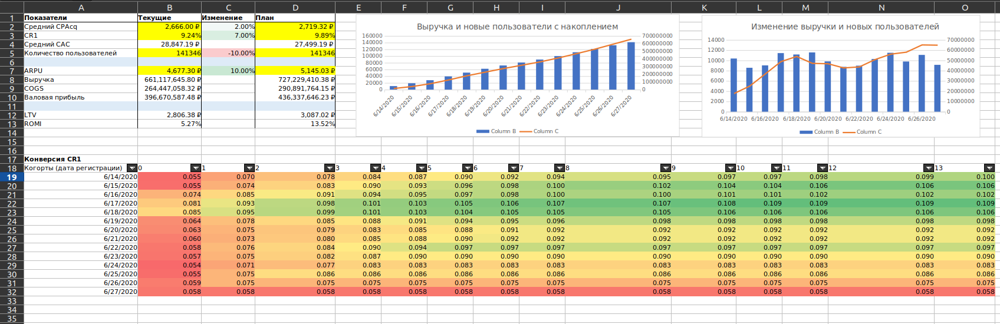

## Калькулятор юнит-экономики в Excel

Расчет фактических и прогнозируемых метрик юнит-экономики онлайн магазина

## Функционал калькулятора

- Расчет LTV на основе валовой прибыли;
- Расчет ROMI;
- Расчет метрик по относительным изменениям.

